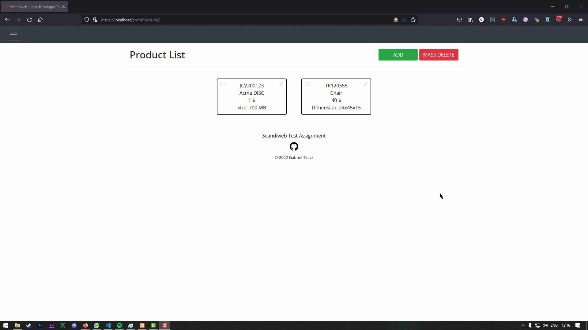
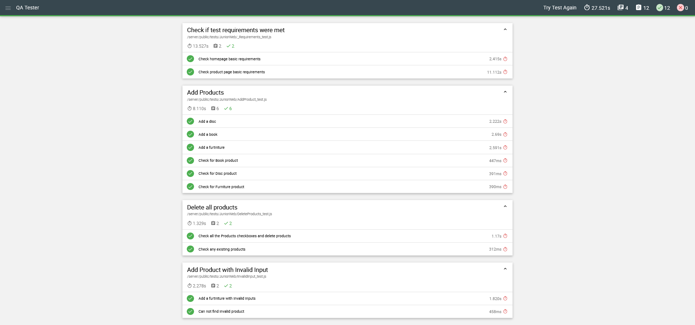

<center>
    <p align="center">
        <br>
        <h1 align="center">Scandiweb Junior Developer Test Task</h1>
        <h4 align="center">Available at: <a href="scandiweb-test-assignment.rf.gd/">scandiweb-test-assignment.rf.gd/</a></h4>
    </p>
</center>

<hr>

<p align="center">
    <h2 align="center">Built with:</h2>
    <center>
        <ul align="center">
            <li align="center">PHP</li>
            <li align="center">MySQL</li>
            <li align="center">javascript</li>
            <li align="center">jQuery</li>
            <li align="center">Bootstrap</li>
            <li align="center">Isotope</li>
        </ul>
    </center>
</p>

<p align="center">
    <h2 align="center">Database structure:</h2>
    <center>
    <table align="center">
        <tr>
            <th>Name</th>
            <th>Type</th>
            <th>Attributes</th>
        </tr>
        <tr>
            <td>SKU</td>
            <td>varchar(30)</td>
            <td>Unique</td>
        </tr>
        <tr>
            <td>NAME</td>
            <td>varchar(65)</td>
            <td>-</td>
        </tr>
        <tr>
            <td>PRICE</td>
            <td>decimal(10,0)</td>
            <td>-</td>
        </tr>
        <tr>
            <td>productType</td>
            <td>enum('Book', 'Furniture', 'DVD')</td>
            <td>-</td>
        </tr>
        <tr>
            <td>productAttribute</td>
            <td>varchar(12)</td>
            <td>-</td>
        </tr>
    </table>
    </center>
</p>
<br>
<h2 align="center">File structure:</h2>

    ```
    📦root
    ┣ 📂app
    ┃ ┗ 📂models
    ┃ ┃ ┣ 📜Book.php
    ┃ ┃ ┣ 📜Database.php
    ┃ ┃ ┣ 📜DVD.php
    ┃ ┃ ┣ 📜Furniture.php
    ┃ ┃ ┗ 📜Product.php
    ┣ 📂resources
    ┃ ┣ 📂css
    ┃ ┃ ┗ 📜main.css
    ┃ ┣ 📂images
    ┃ ┃ ┣ 📜2015-11-09_scandiweb_logo.png
    ┃ ┃ ┣ 📜demo.gif
    ┃ ┃ ┣ 📜edit_black_24dp.svg
    ┃ ┃ ┣ 📜favico.ico
    ┃ ┃ ┣ 📜github.png
    ┃ ┃ ┣ 📜QA.png
    ┃ ┃ ┗ 📜white logo.png
    ┃ ┣ 📂js
    ┃ ┃ ┗ 📜main.js
    ┃ ┗ 📂views
    ┃ ┃ ┣ 📂partials
    ┃ ┃ ┃ ┣ 📜footer.php
    ┃ ┃ ┃ ┗ 📜head.php
    ┃ ┃ ┣ 📜add-product.php
    ┃ ┃ ┣ 📜add.php
    ┃ ┃ ┣ 📜delete.php
    ┃ ┃ ┣ 📜edit-product.php
    ┃ ┃ ┗ 📜edit.php
    ┣ 📂vendor
    ┃ ┣ 📂composer
    ┃ ┃ ┣ 📜autoload_classmap.php
    ┃ ┃ ┣ 📜autoload_namespaces.php
    ┃ ┃ ┣ 📜autoload_psr4.php
    ┃ ┃ ┣ 📜autoload_real.php
    ┃ ┃ ┣ 📜autoload_static.php
    ┃ ┃ ┣ 📜ClassLoader.php
    ┃ ┃ ┗ 📜LICENSE
    ┃ ┗ 📜autoload.php
    ┣ 📜.htaccess
    ┣ 📜composer.json
    ┗ 📜index.php
    ```

<hr>

<center>
    <p align="center">
        <h3 align="center">Demonstration</h3>
        <br><br>
        <h3 align="center">AutoQA approval</h3>
        
    </p>
</center>

<hr>

<center>
    <p align="center">
        <small align="center">&copy; 2022 Gabriel Tkacz</small>
    </p>
</center>